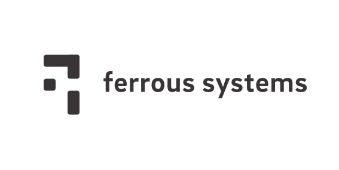

# Sealed Rust

This is the coordination repository for the **Sealed Rust** project, an effort to bring The Rust Programming Language to safety critical software domains, such as Automotive, Industrial, Medical, and Avionics software.

Sealed Rust is a venture of [Ferrous Systems Gmbh](https://ferrous-systems.com).

Please feel free to contact us if you are interested in these efforts by [sending us an email](mailto:sealed-rust@ferrous-systems.com).

## Current Status

We are currently working on developing our plan for this domain. For more information, please see our [introduction blog post](https://ferrous-systems.com/blog/sealed-rust-the-pitch).

